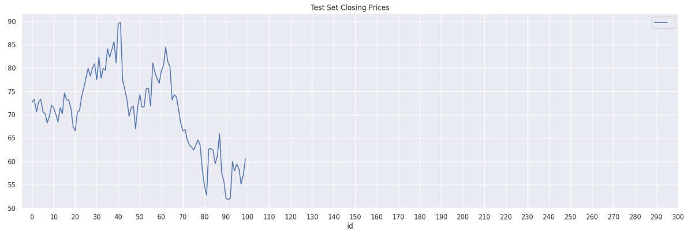
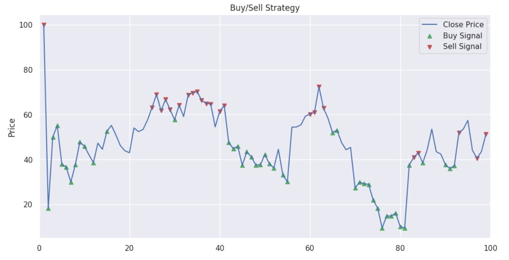

# Stock Forecast

• Utilized the SARIMAX model and feature engineering to predict stock prices.
• Implemented an Ensemble of Random Forest and XGBoost Algorithms to provide buy/sell/hold recommendations for stocks.

